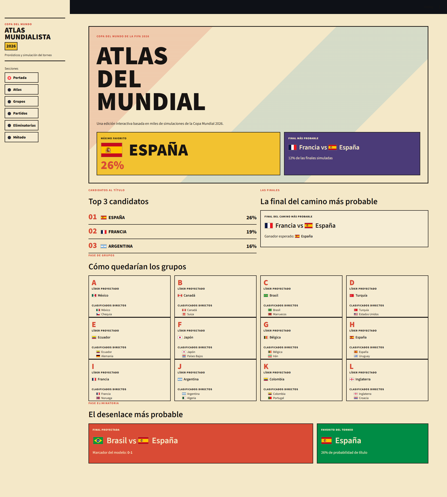
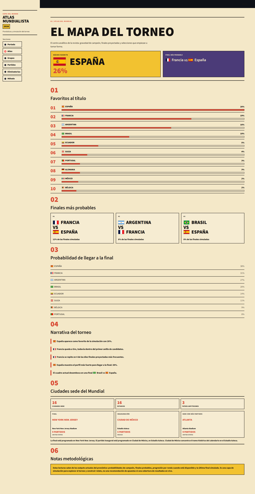
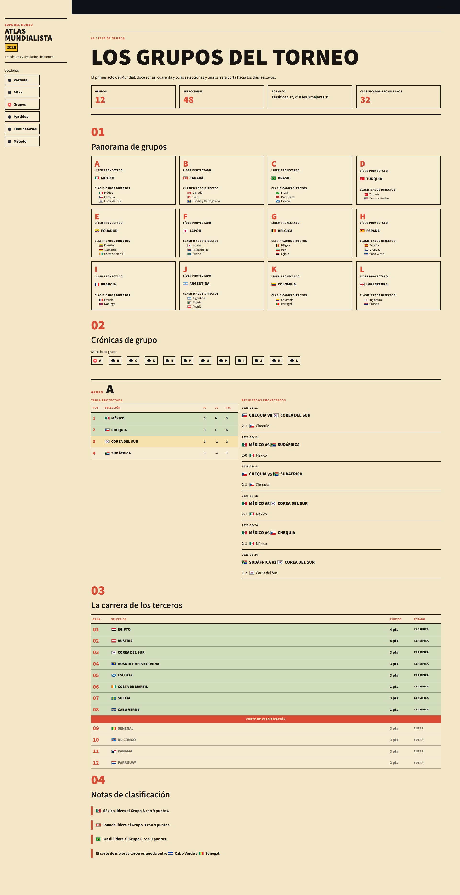
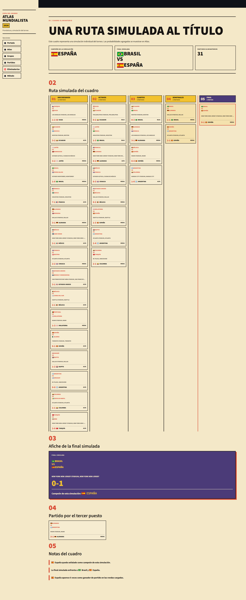
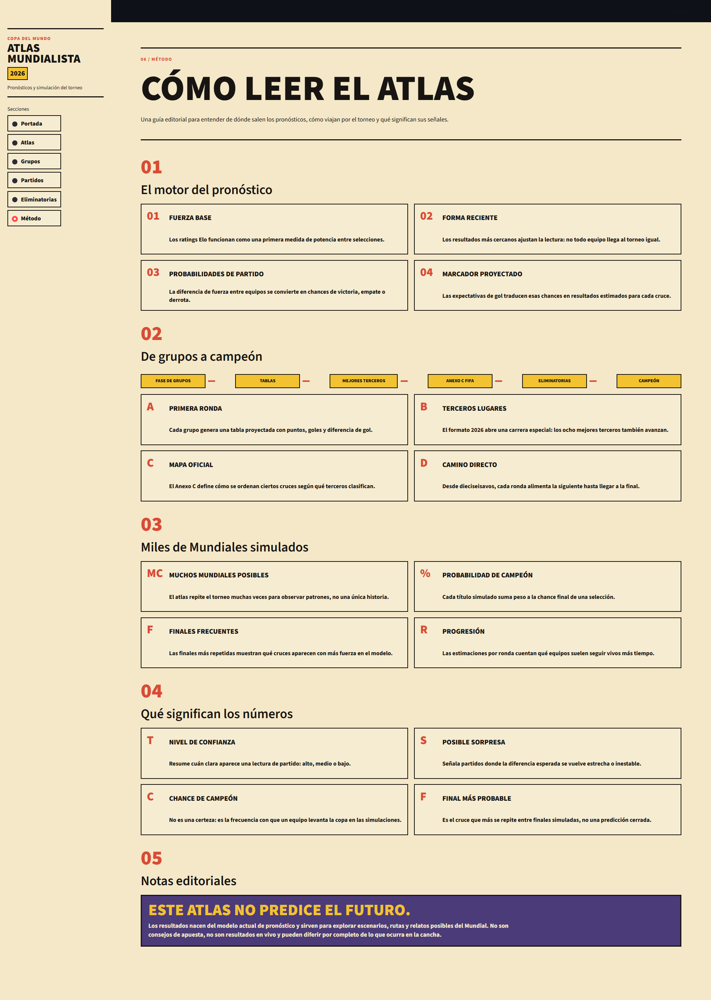

# World Cup Forecast Atlas

Atlas interactivo de simulación y pronóstico para la Copa Mundial de la FIFA 2026.

Construido con Python, Elo Ratings, simulación Monte Carlo, modelos de Goles Esperados (xG), distribuciones de Poisson y Streamlit.

El proyecto comenzó como una herramienta para participar en un prode entre compañeros de trabajo y evolucionó hacia una plataforma de simulación completa capaz de proyectar la fase de grupos, clasificaciones, cuadro eliminatorio y probabilidades de campeón del Mundial 2026.

---

## Demo

<https://world-cup-forecast-atlas.streamlit.app/>

## Experiencia Atlas

El proyecto incluye un Atlas interactivo de estilo editorial que transforma los resultados de la simulación en una revista digital del torneo.

### Secciones Incluidas

* Portada
* Atlas
* Grupos
* Cuadro
* Partidos
* Método

En lugar de presentar predicciones mediante tablas y dashboards tradicionales, el Atlas organiza probabilidades, clasificaciones y escenarios de torneo en una experiencia narrativa inspirada en las clásicas guías mundialistas.

---

## Objetivos del Proyecto

* Consumir y procesar datasets internacionales de fútbol basados en Elo Ratings.
* Generar pronósticos de partidos utilizando fuerza relativa y forma reciente.
* Simular la Copa Mundial de la FIFA 2026 completa.
* Determinar clasificaciones utilizando el formato oficial de 48 selecciones.
* Implementar el sistema de cruces definido por el Anexo C de FIFA.
* Simular todas las rondas eliminatorias hasta la final.
* Explorar escenarios mediante simulación Monte Carlo.
* Servir como proyecto práctico para profundizar conocimientos de Python, ingeniería de datos, modelado probabilístico, testing y diseño de producto.

---

## Características Principales

### Motor de Simulación

* Elo Ratings
* Forma reciente
* Ventaja de local
* Goles esperados (xG)
* Distribución de Poisson
* Monte Carlo
* Actualización dinámica de Elo
* Desempates FIFA

### Simulación del Torneo

* Simulación completa de la fase de grupos
* Generación de tablas de posiciones
* Clasificación de los mejores terceros
* Implementación del formato oficial FIFA 2026
* Implementación del Anexo C de FIFA
* Simulación completa de eliminación directa
* Resolución de empates mediante tiempo suplementario o penales
* Proyección de campeón
* Desempates FIFA para empates entre 2 equipos
* Mini-tablas FIFA para empates entre 3 o más equipos
* Fallback determinístico basado en Elo

### Analítica Monte Carlo

* Generación estocástica de marcadores
* Repetición masiva de torneos
* Probabilidades de campeón
* Finales más probables
* Probabilidades de progresión por ronda

### Atlas Editorial

* Portada interactiva del torneo
* Ranking de candidatos al título
* Narrativa de la fase de grupos
* Carrera de los mejores terceros
* Visualización del cuadro eliminatorio
* Archivo de partidos proyectados
* Guía metodológica

### Operación y Automatización

* Pipeline automatizado end-to-end
* Actualización automática de datasets
* GitHub Actions para ejecución programada
* Validación de frescura de datos
* Logging y monitoreo de ejecución

---

## Arquitectura

### Flujo de Datos

```text
Datasets Externos
        ↓
Ingesta
        ↓
Procesamiento
        ↓
Fuerza de Equipos + Forma Reciente
        ↓
Pronósticos de Partidos
        ↓
Simulación de Grupos
        ↓
Clasificación
        ↓
Anexo C FIFA
        ↓
Eliminación Directa
        ↓
Simulación Monte Carlo
        ↓
Experiencia Atlas
```

---

## Estructura del Proyecto

```text
prode-mundial-2026/
│
├── app/
│   ├── atlas_app/
│   │   ├── components/
│   │   ├── pages/
│   │   ├── data.py
│   │   ├── formatting.py
│   │   └── styles.py
│   │
│   ├── legacy_dashboard.py
│   └── streamlit_app.py
│
├── data/
│   ├── raw/
│   ├── processed/
│   └── output/
│
├── docs/
│   ├── annex_c.md
│   └── knockout_pipeline.md
│
├── src/
│   ├── analysis/
│   ├── ingestion/
│   ├── knockout/
│   ├── predictor/
│   ├── processing/
│   └── simulation/
│
├── tests/
│
├── README.md
├── README_EN.md
└── requirements.txt
```

---

## Páginas del Atlas

### Portada

Puerta de entrada al torneo.

Incluye:

* Favorito actual
* Final más probable
* Resumen de grupos
* Anticipo del camino al título

### Atlas

Panorama general del torneo.

Incluye:

* Probabilidades de campeón
* Finales más probables
* Favoritos y perseguidores
* Narrativa automática del torneo

### Grupos

Cobertura completa de la fase de grupos.

Incluye:

* Tablas de posiciones
* Clasificación proyectada
* Carrera de los mejores terceros
* Pronósticos de cada grupo

### Cuadro

Visualización de eliminación directa.

Incluye:

* Dieciseisavos
* Octavos
* Cuartos
* Semifinales
* Final
* Partido por el tercer puesto

### Partidos

Archivo editorial de pronósticos.

Incluye:

* Pronósticos de partidos
* Indicadores de confianza
* Alertas de sorpresa
* Filtros interactivos

### Método

Explicación del modelo.

Incluye:

* Elo Ratings
* Forma reciente
* Goles esperados
* Modelado Poisson
* Simulación Monte Carlo

---

## Instalación

### Crear entorno virtual

```bash
python -m venv .venv
```

### Activar entorno

#### Windows

```bash
.venv\Scripts\activate
```

#### Linux / macOS

```bash
source .venv/bin/activate
```

### Instalar dependencias

```bash
pip install -r requirements.txt
```

---

## Ejecutar el Atlas

```bash
streamlit run app/streamlit_app.py
```

---

## Ejecutar la Simulación Completa

```bash
python -m src.knockout.tournament
```

---

## Testing

Ejecutar todas las pruebas:

```bash
pytest
```

Actualmente el proyecto incluye más de 60 pruebas automatizadas cubriendo:

* Desempates FIFA
* Anexo C
* Simulación de grupos
* Eliminación directa
* Monte Carlo
* Actualización Elo
* Ingesta de datos
* Resiliencia ante fallos externos
* Validación de outputs

---

## Documentación

Documentación técnica adicional:

* `docs/annex_c.md`
* `docs/knockout_pipeline.md`

---

## Capturas de pantalla

### Portada editorial



### Atlas del torneo



### Fase de grupos



### Cuadro eliminatorio



### Metodología del modelo



---

## Estado del Proyecto

Versión actual: v1.0

Completado:

* Simulación completa del Mundial 2026
* Formato FIFA de 48 selecciones
* Anexo C FIFA
* Motor Monte Carlo
* Atlas editorial interactivo
* Automatización mediante GitHub Actions
* Desempates FIFA para grupos

Posibles evoluciones futuras:

* Cuadro interactivo
* Comparaciones históricas
* Frontend dedicado en Next.js
* API pública de simulación

---

## Resumen Técnico

* 48 selecciones
* 104 partidos
* Formato oficial FIFA 2026
* 495 combinaciones del Anexo C
* Simulación Monte Carlo configurable
* Más de 60 pruebas automatizadas
* Pipeline automatizado mediante GitHub Actions

---

## Descargo

Las predicciones generadas por este proyecto tienen fines educativos, analíticos y recreativos.

Los resultados se obtienen mediante modelos probabilísticos y simulaciones. No constituyen recomendaciones de apuestas ni garantizan resultados reales futuros.
